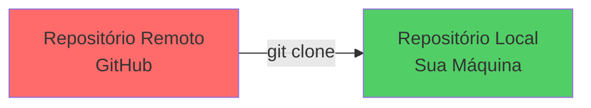
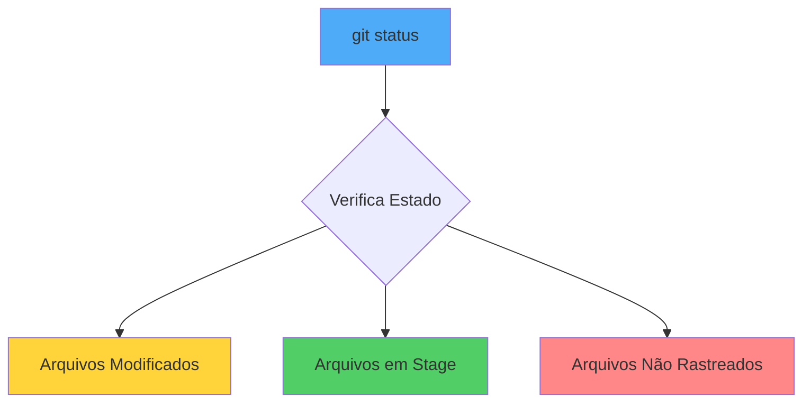
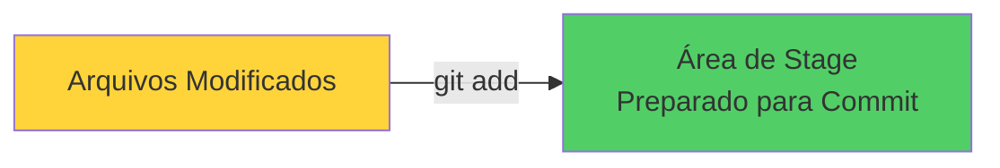
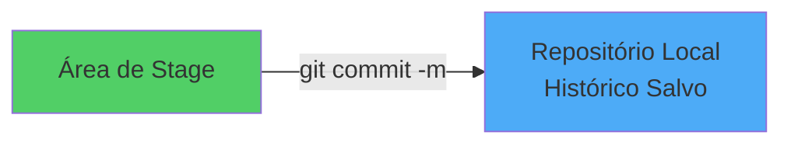
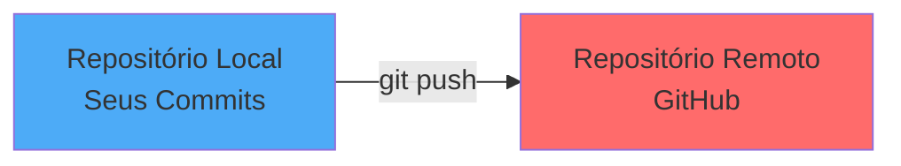
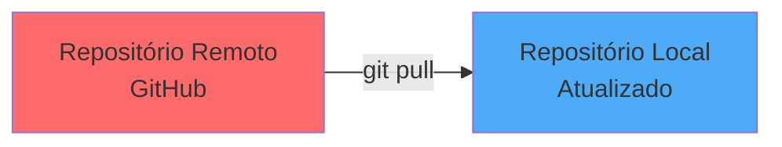
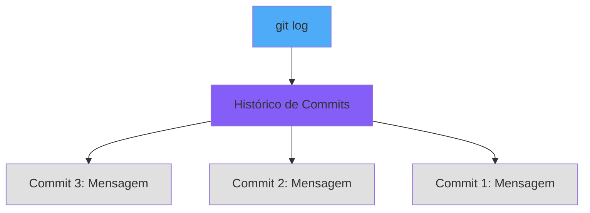
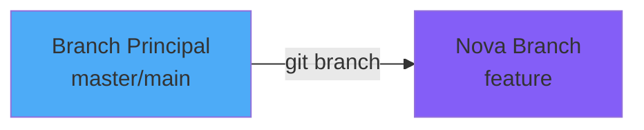
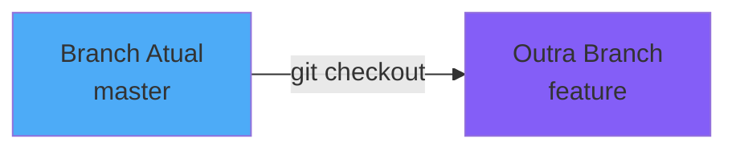
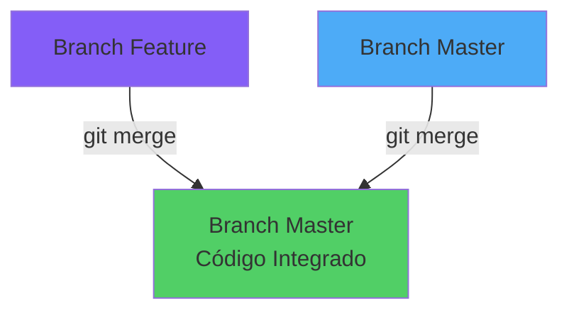

# Hello GitHub - Tutorial Git

Repositório para praticar os comandos básicos do Git.

## 10 Comandos Básicos do Git

### 1. Clone o repositório
```bash
git clone https://github.com/IA-para-DEVs-SD/hello-github.git
```
Copia um repositório remoto para sua máquina local.



### 2. Verifique o status dos arquivos
```bash
git status
```
Mostra quais arquivos foram modificados, adicionados ou estão prontos para commit.



### 3. Adicione arquivos ao stage
```bash
git add .
# ou adicione arquivo específico
git add arquivo.txt
```
Prepara os arquivos modificados para serem commitados.



### 4. Faça um commit das alterações
```bash
git commit -m "Sua mensagem aqui"
```
Salva as alterações no repositório local com uma mensagem descritiva.



### 5. Envie as alterações para o GitHub
```bash
git push
```
Envia seus commits locais para o repositório remoto.



### 6. Baixe as alterações do GitHub
```bash
git pull
```
Baixa e integra as alterações do repositório remoto para seu repositório local.



### 7. Veja o histórico de commits
```bash
git log
# ou versão resumida
git log --oneline
```
Exibe o histórico de commits do projeto.



### 8. Crie uma nova branch
```bash
git branch nome-da-branch
# ou crie e mude para a branch
git checkout -b nome-da-branch
```
Cria um novo ramo de desenvolvimento.



### 9. Mude de branch
```bash
git checkout nome-da-branch
```
Alterna entre diferentes branches do projeto.



### 10. Mescle branches
```bash
git merge nome-da-branch
```
Integra as alterações de uma branch em outra.



## Exercício Prático

1. Clone este repositório
2. Crie uma nova branch com `git checkout -b minha-branch`
3. Modifique o arquivo `hello.py`
4. Use `git status` para ver as mudanças
5. Adicione as mudanças com `git add .`
6. Faça commit com `git commit -m "Mensagem descritiva"`
7. Volte para a branch principal com `git checkout master`
8. Mescle suas alterações com `git merge minha-branch`
9. Envie para o GitHub com `git push`
10. Veja o histórico com `git log --oneline`

## Dicas Importantes

- Sempre use `git status` antes de fazer commit
- Escreva mensagens de commit claras e descritivas
- Faça `git pull` antes de começar a trabalhar para ter a versão mais recente
- Use branches para desenvolver novas funcionalidades

Boa prática! 🚀
